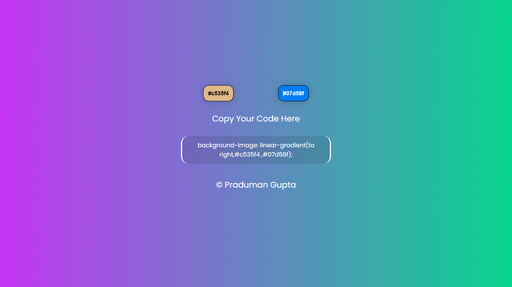

# 🎨 Random Gradient Generator

This is a simple and interactive **Random Gradient Generator** built using HTML, CSS, and JavaScript. The project allows users to generate beautiful linear gradients by clicking two separate buttons – one for each color of the gradient. Every time a button is clicked, the color on one side of the gradient changes and the button label updates with the corresponding HEX code.

## 🚀 Features

- 🎨 Two buttons to generate random HEX color codes.
- 🌈 Dynamic background gradient updates in real-time.
- 🧾 Color HEX codes appear as the text content of each button.
- 🔁 A separate box displays the live CSS gradient code, which updates instantly with any color change and you can copy the full code by just clicking on it .
- 📋 Perfect for quick CSS color inspiration or for learning purposes.

## 🖼️ Preview

## 📁 Project Structure 

## 🔧 How It Works

1. Click either of the two buttons.
2. The corresponding side of the gradient will be assigned a new random HEX color.
3. The background updates immediately to reflect the change.
4. The HEX code of the new color appears as the text on the button.
5. The CSS `background-image` property is also shown in a separate box, ready to copy.

## 🛠️ Technologies Used

- HTML5
- CSS3
- JavaScript

## 📌 Use Case

Useful for:
- Designers seeking quick color combinations.
- Developers looking for cool gradient backgrounds.
- Beginners learning DOM manipulation and event handling.

## 🧑‍💻 Author

Made with ❤️ by [Praduman Gupta]

---

